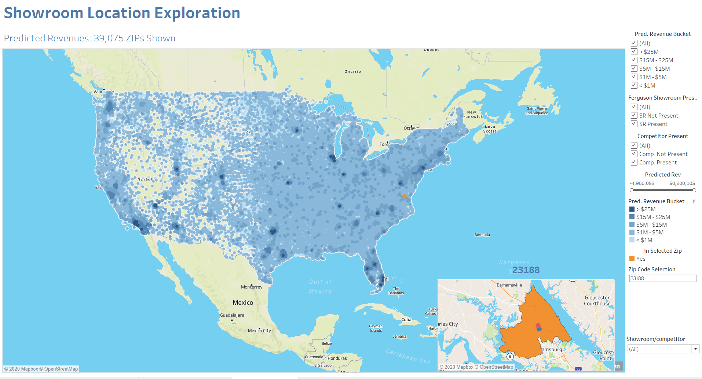

## Projects Overview

Ferguson has many different kinds of locations, with one of the most important being their customer-facing showrooms, which sell bath, kitchen, and lighting products. Despite the importance of these showrooms for generating revenue, the selection of locations for the showrooms has been somewhat arbitrary in the past.
<br/>
<br/>
Our task in this project was to produce a tool for assisting in selecting promising showroom locations based on predicted revenue for these locations output from a model that we created.


## View Tableau Visualizations



[You can also view the dashboard on Tableau online](https://public.tableau.com/profile/zhongyi1091#!/vizhome/Ferguson_Tool_final/ShowroomSelection?publish=yes)


## Projects Reports

We were able to successfully produce a tool to assist in selecting promising locations for new showrooms. The tool we produced is a dashboard with a map of all ZIP codes that we had any data for, with our model’s predicted revenue for each ZIP code. This dashboard allows for exploration of the highest predicted revenue locations overall, or with other features, such as the highest predicted revenue ZIP codes where there is already a competitor, or only where there is no competitor present.
<br/><br/>
The model we used to predict revenue for each ZIP code was a machine learning model called a gradient boosting model, or GBM. The variables that we used for this model included both data we received from Ferguson, and data that we found from reputable government sources. The data from Ferguson that we used in our model included: building permits, population density, estimated showroom demand, population in group quarters, and number of competitors within the ZIP code. The variables that we found from other sources that we included in the model were average adjusted gross income per tax return and the estimated number of construction businesses.
<br/><br/>
This model and the dashboard built off of it allowed us to create the list of top clusters (Best_Clusters.xlsx), with clusters currently lacking a Ferguson showroom being especially promising possibilities for new showroom building. Many other variations of this exploration should be possible with the Showroom Location Exploration dashboard.

## Gradient Boost Model 

```markdown
#Load Library
rm(list=ls())
library(dplyr)
# install.packages("ggcorrplot")
library(ggcorrplot)
set.seed(1)
#MASTER DATASET
masterData <- read.csv("MASTER.csv", header=T)
#new column
masterData$X2016.Population.in.Group.Quarters.Rate <- (masterData$X2016.Population.in.Group.Quarters / masterData$X2016.Total.Population) * 100
#Select columns
masterDataSubset <- masterData %>% select(Showroom.Demand,Permits, est...constr.bus, 
                                          X2016.Population.in.Group.Quarters,
                                          X2016.Population.Density,
                                          Avg_AGI_per_return, 
                                          competitor.count,revenue)
sum(is.na(masterDataSubset)) #81512
sapply(masterDataSubset, function(x) sum(is.na(x)))
masterDataSubset[is.na(masterDataSubset)] <- 0
sum(is.na(masterDataSubset)) #0
#subset on only ferguson showroom
ferguson = filter(masterData, !is.na(masterData$revenue) | masterData$revenue != "")
summary(ferguson)
ferguson_subset= ferguson %>% select(Showroom.Demand,Permits, est...constr.bus, 
                                     X2016.Population.in.Group.Quarters,
                                     X2016.Population.Density,
                                     Avg_AGI_per_return, 
                                     competitor.count,revenue)
sum(is.na(ferguson_subset)) #5
#X2016.Population.in.Families ->1, Avg_AGI_per_return ->2
ferguson_subset[is.na(ferguson_subset)] <- 0
#correlation
corr <- round(cor(ferguson_subset), 3) 
#Train&Validate
n <- nrow(ferguson_subset)
trainprop = 0.8
train  <-  sample(n, trainprop * n)
validate  <-  sample(setdiff(1:n, train)) 
trainset <- ferguson_subset[train,]
validateset <- ferguson_subset[validate,]
#gbm
library(gbm)
gbmMod <- gbm(revenue~.,data=trainset,distribution="gaussian",n.trees=5000,interaction.depth=4)
summary(gbmMod)
yhat.boost <- predict(gbmMod,newdata=validateset,n.trees=5000)
gbmMSE=mean((yhat.boost-validateset$revenue)^2)
gbmMSE
#prediction
masterDataSubset$predicted_rev <- predict(gbmMod,newdata=masterDataSubset,n.trees=5000)
boosting_predictions <- masterDataSubset
summary(boosting_predictions)
#save file 
write.csv(boosting_predictions, 'boosting_predictions_with_rate.csv',row.names = F)

```


